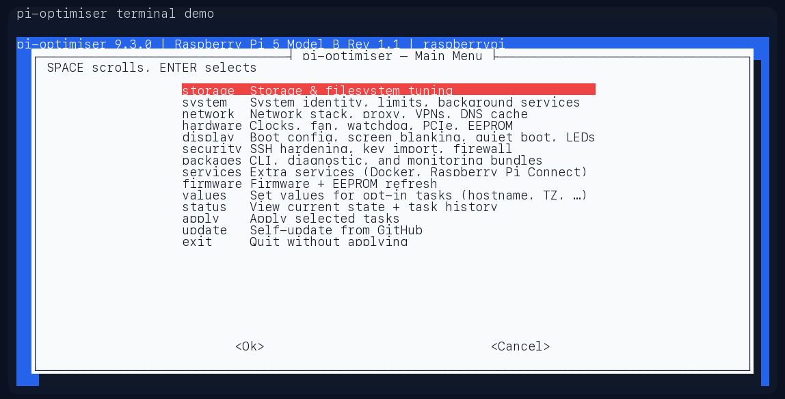
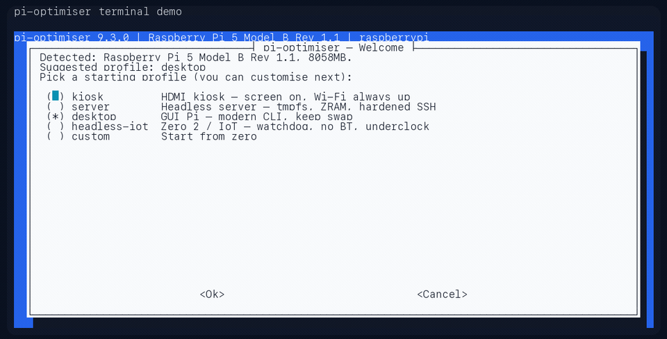
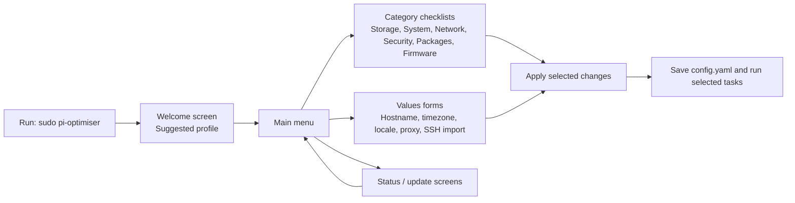
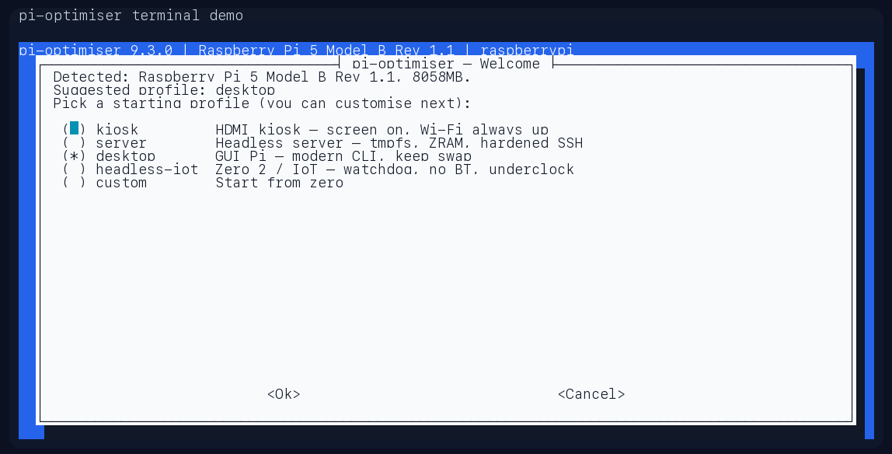
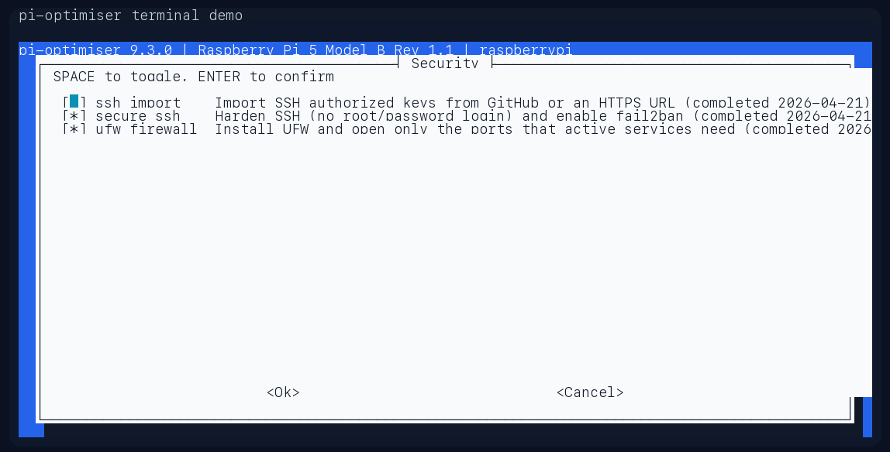
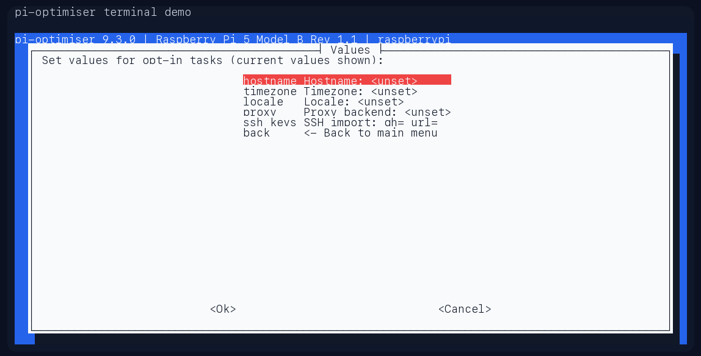

# pi-optimiser

[](https://github.com/extremeshok/pi-optimiser/actions/workflows/shellcheck.yml)
[](https://github.com/extremeshok/pi-optimiser/actions/workflows/integration.yml)
[](https://github.com/extremeshok/pi-optimiser/releases)
[](LICENSE)

Set up a Raspberry Pi faster, safer, and with less guesswork.

`pi-optimiser` is a menu-driven post-install setup tool for **Raspberry Pi OS (Bookworm/Trixie or newer, 64-bit)**. It helps you harden SSH, tune storage, configure networking, install common packages and services, and apply firmware or boot changes from one guided terminal workflow. New users can follow the menu. Advanced users still get profiles, CLI flags, dry runs, snapshots, undo, and repeatable automation.

[Quick Start](#quick-start) | [Watch Demo](docs/media/pi-optimiser-demo.gif) | [Menu Workflow](#menu-driven-workflow) | [Advanced CLI](#advanced-cli--automation)



## Why People Use It
- **Menu first, flags second**: the default experience is a guided `whiptail` flow instead of a wall of shell options.
- **Useful changes in one pass**: storage, security, packages, networking, display, services, and firmware tuning are grouped into one workflow.
- **Safer than ad-hoc tweaking**: dry runs, per-task state, backup journals, snapshots, and undo reduce the risk of hand-editing system files.
- **Built for real Raspberry Pi deployments**: Pi 5/500, Pi 4/400, Pi 3, and Pi Zero 2 are first-class targets, with hardware-aware defaults and preflight checks.

## Common Use Cases
- **Headless server / homelab node**: start with `server` for hardened SSH, firewall, DNS cache, node exporter, smartmontools, and LED-off defaults.
- **Daily desktop Pi**: start with `desktop` when you want the guided setup flow but prefer a lighter touch on services and swap.
- **Kiosk / signage box**: use `kiosk` for screen-first deployments that need quiet boot, ZRAM, and reliable Wi-Fi.
- **Small remote or IoT system**: use `headless-iot` for watchdog, Bluetooth-off, underclock, quiet boot, and low-overhead headless defaults.

## What You Get
- **Menu-driven by default**: launch it on a real terminal and `whiptail` opens a guided flow with profile suggestions, category checklists, value forms, status screens, and an apply step that writes `/etc/pi-optimiser/config.yaml`.
- **Hardware-aware configuration** for Pi 5/500, Pi 4/400, Pi 3, and Pi Zero 2, with preflight checks for throttling, power issues, and connectivity before any changes.
- **Storage longevity** tweaks: aggressive apt hygiene, tmpfs mounts for `/tmp` and `/var/log`, journal rate limits, and pessimistic writeback tuning.
- **Optional extras** you can add à la carte: compressed ZRAM swap, Tailscale, Docker, per-model overclocking (Pi 5/500 ship at 2.8 GHz), NGINX proxy, kiosk display tuning, bootloader EEPROM tuning, non-interactive `rpi-update`, and SSH hardening with fail2ban.
- **Runtime tuning** pinned to `performance` via a systemd unit so the CPU governor stays set across reboots.
- **Auditability**: every task logs to `/var/log/pi-optimiser.log` (rotated weekly), state lives in `/etc/pi-optimiser/state.json` (schema v2, JSON), backups carry timestamped `.pi-optimiser.*` suffixes with `/etc/pi-optimiser/backups/<task>.json` journals for `--undo`, and `--snapshot` captures the full pre-change config tree.
- **Helpful introspection**: `--list-tasks`, `--list-profiles`, `--status`, `--report`, `--validate-config`, `--check-update`. All accept `--output json` for scripting.

## Quick Start

**One-liner install (recommended):**
```bash
curl -fsSL https://raw.githubusercontent.com/extremeshok/pi-optimiser/master/install.sh | sudo bash
```
Pin a specific release by exporting `PI_OPTIMISER_REF=vX.Y.Z`
(e.g. `PI_OPTIMISER_REF=v9.4.0 curl … | sudo -E bash`) to freeze
the ref the installer and later `--update` runs track.

The bootstrap installs into `/opt/pi-optimiser/releases/<id>/`, flips
the `current` symlink, and drops a launcher at
`/usr/local/sbin/pi-optimiser`. After install:
```bash
sudo pi-optimiser
```



When you choose **Apply**, the TUI writes `/etc/pi-optimiser/config.yaml`
automatically. That saved config becomes the repeatable input for later
batch runs, for example:
```bash
sudo pi-optimiser --no-tui --config /etc/pi-optimiser/config.yaml --yes
```

That opens the guided menu on a normal interactive terminal. For a
quick read-only overview instead, run:
```bash
sudo pi-optimiser --report
```

**Single-file bundle (no install):**
Download `pi-optimiser-<version>.sh` from the GitHub release page and
run it directly; the bundle inlines every task/util/feature module.

**From a git checkout:**
```bash
chmod +x pi-optimiser.sh
sudo ./pi-optimiser.sh
```
Or `sudo ./pi-optimiser.sh --migrate` to promote the checkout to an
installed layout under `/opt/pi-optimiser/`.

Typical first-run flow:
1. Run `sudo pi-optimiser`.
2. Accept or change the suggested profile on the welcome screen.
3. Walk the category menus and the **Values** form for hostname,
   timezone, locale, proxy, and SSH key import.
4. Select **Apply** to save the config and run the chosen tasks.
5. Reboot if the run tells you boot or firmware changes need it.

Helpful commands:
- `sudo pi-optimiser --status` – show task history, timestamps, and
  per-task version drift (`CURRENT` vs `RAN`).
- `sudo pi-optimiser --list-tasks` – see available tasks.
- `sudo pi-optimiser --list-profiles` – what each profile enables.
- `sudo pi-optimiser --report` – human-readable overview of system
  state (hardware, runtime, disk, disabled services, task summary).
- `sudo pi-optimiser --dry-run --profile server` – preview exactly
  which tasks would run under a profile, no side effects.
- `sudo pi-optimiser --check-update` – exit code 10 if an update
  is available, 0 if you're on the latest master.
- `sudo pi-optimiser --undo <task>` – restore files the task last
  modified from its backup journal.
- `sudo pi-optimiser --snapshot` / `--restore <archive>` – full
  pre-change config snapshot and rollback.

## Menu-Driven Workflow

For most users, the product is now:

```bash
sudo pi-optimiser
```

The interactive flow is:



What people see in the TUI:
- A welcome screen with a suggested profile such as `desktop`, `server`, `kiosk`, or `headless-iot`.
- A main menu that groups tasks by category instead of forcing users to remember dozens of flags.
- Value forms for common inputs so hostname, timezone, locale, proxy backend, and SSH key import can be filled in directly.
- An apply step that saves `/etc/pi-optimiser/config.yaml` and then runs the selected work.

In practice, treat the CLI flags as the advanced path. The default experience is the guided menu.

## Advanced CLI & Automation

The CLI is still fully supported for automation, remote rollouts, and
repeatable batch runs. Use it when you want to script the tool, pin a
profile, or run a single task non-interactively.

| Flag | Description |
|------|-------------|
| `--force` | Re-run tasks even if marked complete. |
| `--dry-run` | Log intended actions only. |
| `--status` | Print task status table and exit. |
| `--list-tasks` | Show task list with descriptions. |
| `--skip <task>` | Skip a task (repeatable). |
| `--only <task>` | Run only specific tasks (repeatable). |
| `--install-tailscale` | Enable the Tailscale task. |
| `--install-wireguard` | Install `wireguard-tools` (mutex with Tailscale unless `--allow-both-vpn`). |
| `--install-docker` | Enable the Docker task. |
| `--docker-buildx-multiarch` | Install `qemu-user-static` + seed binfmt so Docker buildx can build multi-arch images. |
| `--docker-cgroupv2` | Append `systemd.unified_cgroup_hierarchy=1` to `cmdline.txt`. Reboot required. |
| `--install-pi-connect` | Install Raspberry Pi Connect (WebRTC remote access). |
| `--install-hailo` | Pi 5/500: install Hailo NPU drivers for the AI Kit / AI HAT+. |
| `--install-firewall` | Install and enable UFW with deny-in + allow outbound, auto-opens SSH / active VPN / proxy ports. |
| `--install-node-exporter` | Install `prometheus-node-exporter` on `:9100`. |
| `--install-smartmontools` | Install `smartmontools` + enable `smartd`. |
| `--install-cli-modern` | Install a modern CLI bundle (ripgrep, fd, bat, neovim). |
| `--install-net-diag` | Install network-diagnostic tools (nmap, iperf3, tcpdump). |
| `--install-chrony` | Replace `systemd-timesyncd` with `chrony` (better on flaky networks). |
| `--enable-dns-cache` | Enable the `systemd-resolved` stub DNS cache. |
| `--locale <locale>` | Configure system locale, e.g. `en_GB.UTF-8`. |
| `--proxy-backend <url|off|disable|disabled>` | Manage the NGINX proxy helper. |
| `--install-zram` | Enable the compressed ZRAM swap task (disabled by default). |
| `--zram-algo <lz4|zstd|disabled>` | Override the ZRAM compression or disable existing configuration. |
| `--overclock-conservative` | Apply CPU/GPU overclock profile (Pi 5/500 runs at 2.8 GHz with `over_voltage_delta=30000`; other models use firmware-safe clocks). Requires healthy power. |
| `--underclock` | Apply a low-power underclock profile (mutex with `--overclock-conservative`). |
| `--pcie-gen3` | Pi 5/500: enable PCIe Gen 3 for NVMe HATs (`dtparam=pciex1_gen=3`). Reboot required. |
| `--temp-limit <C>` | Set firmware `temp_limit` (degrees C). |
| `--temp-soft-limit <C>` | Set firmware `temp_soft_limit` (degrees C). |
| `--initial-turbo <sec>` | Set firmware `initial_turbo` window (seconds). |
| `--nvme-tune` | Disable NVMe APST for compatibility with quirky Pi 5 NVMe HATs. Reboot required. |
| `--usb-uas-quirks` | Auto-detect known-bad USB-SATA/NVMe bridges and append `usb-storage.quirks` to `cmdline.txt`. |
| `--usb-uas-extra <list>` | Extra `VID:PID` pairs (comma-separated) for UAS quirks. |
| `--wifi-powersave-off` | Disable Wi-Fi power save via a systemd helper. |
| `--disable-bluetooth` | Disable and mask the Bluetooth stack + overlay. |
| `--disable-ipv6` | Disable IPv6 via sysctl drop-in at `/etc/sysctl.d/98-pi-optimiser-ipv6.conf`. |
| `--quiet-boot` | Hide the rainbow splash and silence kernel log at boot. Reboot required. |
| `--disable-leds` | Turn off activity/power/ethernet LEDs (rack/headless). Reboot required. |
| `--headless-gpu-mem` | Pi 4/400/3/Zero 2 only: shrink the GPU memory split to 16 MB for headless deployments. Pi 5/500 ignored. |
| `--power-off-halt` | Pi 5/500 EEPROM: cut 3V3 on shutdown (~0.01 W idle). Skip if HATs need 3V3 while "off". |
| `--remove-cups` | Purge CUPS + printer-driver packages (auto-applied on `kiosk`/`server`/`headless-iot`). |
| `--secure-ssh` | Disable root SSH login, keep user passwords, and enable fail2ban. |
| `--firmware-update` | Run `rpi-update` non-interactively (`SKIP_WARNING=1`) to pull the latest Raspberry Pi firmware. Reboot required. |
| `--eeprom-update` | Refresh the Pi 4/5 bootloader EEPROM via `rpi-eeprom-update -a`. Reboot required. |
| `--enable-watchdog` | Add `dtparam=watchdog=on` to config.txt and wire systemd `RuntimeWatchdogSec=15`. Reboot required. |
| `--pi5-fan-profile` | Apply a Pi 5 PWM fan curve (50/60/67/75 C) via `dtparam=fan_temp*`. Pi 5/500 only. |
| `--timezone <tz>` | Set the system timezone via `timedatectl set-timezone`. |
| `--hostname <name>` | Set the system hostname and update `/etc/hosts`. |
| `--ssh-import-github <user>` | Append `https://github.com/<user>.keys` to the login user's `authorized_keys`. |
| `--ssh-import-url <url>` | Append a remote `https://…` key list to the login user's `authorized_keys`. |
| `--keep-screen-blanking` | Preserve default screen blanking. |
| `--profile <name>` | Apply a flag bundle: `kiosk` / `server` / `desktop` / `headless-iot`. |
| `--config <path>` | Load a YAML config first; CLI flags still win. |
| `--no-config` | Ignore `/etc/pi-optimiser/config.yaml` for this run. |
| `--list-profiles` | Print built-in profiles (text + `--output json`). |
| `--validate-config <path>` | Parse-check a YAML config without side effects. |
| `--report` | Human-readable state overview (text + `--output json`). |
| `--snapshot` / `--restore <path>` | Tar / untar `/etc/{fstab,hosts,…}` + `/boot/firmware/*`. |
| `--undo <task>` | Roll back files captured in `<task>`'s backup journal. |
| `--check-update` | Compare installed vs remote SHA on `master`. Exit 10 if ahead, 0 if synced. |
| `--update` | Pull the configured ref, verify, atomic-swap `current`, record SHA. |
| `--enable-update-timer` / `--disable-update-timer` | Opt-in daily systemd timer. |
| `--require-signature` | Refuse updates without a valid minisign signature. Verifier ships; there is no official signing pipeline (see Security notes below), so the operator supplies their own key. |
| `--migrate` / `--uninstall` / `--rollback` | Manage the `/opt/pi-optimiser` install tree. |
| `--tui` / `--no-tui` | Force or suppress the whiptail menu. |
| `--yes` / `--non-interactive` | Skip confirmation prompts. |
| `--output {text,json}` | Machine-readable mode for `--status`, `--report`, `--check-update`, `--list-profiles`, `--show-config`. |
| `--show-config` | Print the effective config (CLI + YAML + defaults). Honours `--output json`. |
| `--self-test` | Run every task's preconditions read-only and print a pass/skip table. No side effects. |
| `--completion {bash,zsh}` | Emit a completion script on stdout. |
| `--watch` | Re-run on `config.yaml` changes (uses `inotifywait`, polls every 10 s as fallback). |
| `--diff` | Preview proposed `config.txt` / `cmdline.txt` edits without writing. |
| `--freeze-task <id>` | Treat `<id>` as completed even if its code version bumps (repeatable). |
| `--no-metrics` | Skip writing the Prometheus textfile-collector metrics. |
| `--metrics-path <path>` | Override the Prometheus metrics output path. |
| `--reboot` | Immediately reboot (`shutdown -r now`) after a successful run when any reboot-required task ran. Safe for remote Pis — always restarts, never halts. |
| `--allow-both-vpn` | Allow `--install-tailscale` and `--install-wireguard` together (normally mutex). |
| `--help` / `--version` | Self-explanatory. |

For non-interactive runs, combine flags as needed, for example:
```bash
sudo ./pi-optimiser.sh --install-tailscale --proxy-backend http://127.0.0.1:8080 --secure-ssh
```

To force the menu on an installed system:
```bash
sudo pi-optimiser --tui
```

To suppress the menu and stay in batch mode:
```bash
sudo pi-optimiser --no-tui --profile server --yes
```

## Tasks & Behaviour
The script executes these tasks in order unless skipped. **Optional** tasks require their respective flags.

| Task ID | Purpose |
|---------|---------|
| `full_upgrade` | **Always runs first on every invocation.** `apt-get update && full-upgrade && autoremove && autoclean`, fully non-interactive. Not idempotent by design — reruns every time to keep packages current. |
| `remove_bloat` | Purge bundled educational/demo packages and clean apt caches. |
| `fstab` | Add `noatime` + longer commit interval to `/`. |
| `tmpfs_tmp` | Mount `/tmp` on tmpfs (200 MB). |
| `var_log_tmpfs` | Move `/var/log` to tmpfs (50 MB) and recreate structure via tmpfiles. |
| `disable_swap` | Disable `dphys-swapfile` and turn off swap. |
| `zram` † | Configure compressed swap (requires `--install-zram`; override/disable with `--zram-algo`). |
| `fstrim` | Enable `fstrim.timer` for periodic SSD/NVMe TRIM. |
| `journald` | Keep the journal in RAM with 50 MB runtime limit. |
| `sysctl` | Apply writeback, swappiness, inotify, and net backlog tweaks. |
| `cpu_governor` | Install a systemd unit that pins the CPU scaling governor to `performance` on every boot. |
| `apt_conf` | Harden unattended apt jobs and trim caches. |
| `unattended` | Configure security-only unattended upgrades on a 6‑hour timer. |
| `cli_tools` | Install useful CLI utilities (`htop`, `tmux`, `pigz`, etc.). |
| `locale` | Set `/etc/default/locale` when `--locale` is provided. |
| `timezone` † | Set the system timezone when `--timezone` is provided. |
| `hostname` † | Set the system hostname when `--hostname` is provided. |
| `limits` | Raise user/system file descriptor and process limits. |
| `screen_blanking` | Disable console + LightDM blanking (unless `--keep-screen-blanking`). |
| `disable_services` | Turn off non-essential services: `triggerhappy`, `bluetooth`, `hciuart`, `avahi-daemon`, `cups`, `rsyslog` (journald keeps all logs). |
| `proxy` † | Manage the NGINX reverse proxy (`--proxy-backend URL` or disable). |
| `boot_config` † | Apply display-friendly defaults for Pi 4/400 and Pi 5/500 firmware. |
| `libliftoff` † | Ensure vc4 KMS overlays disable liftoff to curb compositor glitches. |
| `oc_conservative` † | Overclock per model — Pi 5/500 to 2.8 GHz, Pi 4/400/3/Zero 2 firmware-safe clocks. |
| `eeprom_config` | Tune bootloader EEPROM `SDRAM_BANKLOW` (Pi 5/500 → 1, Pi 4/400 → 3) via `rpi-eeprom-config --apply`. |
| `pi5_fan` † | Pi 5/500 PWM fan curve (50/60/67/75 C) via `dtparam=fan_temp*` (`--pi5-fan-profile`). |
| `watchdog` † | Enable hardware watchdog and wire systemd to feed it (`--enable-watchdog`). |
| `ssh_import` † | Import `authorized_keys` from GitHub/URL (`--ssh-import-github`, `--ssh-import-url`). |
| `secure_ssh` † | Harden sshd (no root login) and enable fail2ban sshd jail. |
| `tailscale` † | Install/enable Tailscale repository and service. |
| `docker` † | Install Docker Engine (preferred repo or distro fallback). |
| `eeprom_refresh` † | Refresh bootloader EEPROM via `rpi-eeprom-update -a` (`--eeprom-update`). |
| `firmware_update` † | Run `rpi-update` non-interactively to pull the latest firmware (`--firmware-update`). |

† Runs only when the associated flag is supplied (or when explicitly disabling).

### Overclock Profiles
| Model | Profile Applied | Notes |
|-------|-----------------|-------|
| Pi 5 / Pi 500 | `over_voltage_delta=30000`, `arm_freq=2800`, `gpu_freq=950` | 2.8 GHz A76 with +30 mV DVFS delta. Requires healthy power (checked in preflight) and solid cooling. |
| Pi 4 | `arm_freq=1750`, `gpu_freq=600` | |
| Pi 400 | `arm_freq=2000`, `gpu_freq=600` | Matches official 2 GHz support. |
| Pi 3 | `arm_freq=1400`, `gpu_freq=500` | |
| Pi Zero 2 | `arm_freq=1200`, `gpu_freq=500` | |

If preflight detects undervoltage or throttling, the overclock, EEPROM, and firmware-update tasks are skipped automatically.

### EEPROM SDRAM Tuning
`eeprom_config` runs `rpi-eeprom-config --apply` to set `SDRAM_BANKLOW` on Raspberry Pi bootloader EEPROMs:

| Model | `SDRAM_BANKLOW` |
|-------|-----------------|
| Pi 5 / Pi 500 | `1` |
| Pi 4 / Pi 400 | `3` |

The previous EEPROM configuration is backed up under `/etc/pi-optimiser/eeprom/boot.conf.*.bak` before the change is staged. Reboot to activate.

### Firmware Update (`--firmware-update`)
Runs `SKIP_WARNING=1 yes y | rpi-update` so the updater skips every `y/N` prompt and pulls the latest firmware branch. A reboot is required for the new firmware to take effect. Skipped automatically if preflight detects power/thermal blockers or the network is unreachable.

### SSH Hardening (`--secure-ssh`)
- Forces `PermitRootLogin no` while keeping `PasswordAuthentication yes` for regular users.
- Disables challenge-response auth and ensures PAM stays enabled.
- Installs fail2ban with a systemd-backed `sshd` jail (5 retries, 10‑minute ban).
- Reloads the `ssh` service and enables `fail2ban.service`.

## Hardware & Safety Checks
Before tasks run, the script:
1. Captures model, firmware, RAM size, boot device, and kernel.
2. Parses `vcgencmd get_throttled` and temperature readings, logging warnings or blockers.
3. Ensures the root filesystem has ≥512 MB free.
4. Tests network reachability (Google DNS and Cloudflare) to warn about package installs.

Power/thermal blockers skip safety-sensitive tasks (e.g., display tweaks and overclocking).


## Concurrency

A single `flock` at `/var/lock/pi-optimiser.lock` serialises runs.
Two sudo invocations (e.g. a human triggering `--update` while the
daily timer fires) can't race on `state.json`, the backup journals,
or `config-optimisations.json`. The second invocation exits with a
clear error if it can't acquire the lock.

## Security posture

- **Self-update is opt-in.** `pi-optimiser` never reaches out to the
  network unless you pass `--update`, `--check-update`, or install
  the optional daily timer via `--enable-update-timer`.
- **Update integrity.** Tarballs are fetched over HTTPS with
  `curl -fsSL` (system CA bundle). The staged tree's entry script is
  run through `bash -n` before the atomic `current` symlink flip,
  so syntactically-broken updates can't land. Opt-in minisign
  verification (`--require-signature`) is wired — users who want
  stricter verification can sign the bundle with their own key.
  There is no official signing pipeline: for a single-maintainer
  project the signing key and the GitHub credentials share a blast
  radius, and TLS + pinned-tag + SHA-256 matches the trust posture
  of every other `curl | bash` installer on the internet.
- **Config file safety.** Values from `/etc/pi-optimiser/config.yaml`
  (and any `--config <path>`) are `shlex.quote()`-ed in the Python
  emitter before the bash eval. A malicious YAML cannot execute
  arbitrary shell as root.
- **Snapshot restore.** `--restore <tarball>` refuses archives that
  contain absolute paths, `..` traversal, or symlinks whose targets
  leave the archive.
- **State file permissions.** `/etc/pi-optimiser/snapshots` and
  `/etc/pi-optimiser/backups` are `0700`. Individual `.pi-optimiser.*`
  backups inherit the source file's mode (so `sshd_config` backups
  stay `0600`).
- **Trust model.** When you pass `--update`, you are asking
  pi-optimiser to run code fetched from the GitHub repo. That's the
  same trust posture as any `curl | sudo bash` installer. Pin
  `PI_OPTIMISER_REF=v9.0.1` in your environment to freeze the ref,
  or never enable the update timer.

## Project Layout
From 8.0 onwards the tree is:

```
pi-optimiser.sh            Entry script
lib/MANIFEST               Task execution order
lib/util/*.sh              Shared helpers (14 modules)
lib/tasks/*.sh             One file per task (43 tasks)
lib/features/*.sh          Framework features (profile, report, snapshot, undo)
```

Task IDs are stable and map to `run_<id>` entry functions. Each task
file starts with a `# >>> pi-task ... # <<< pi-task` metadata fence
and calls `pi_task_register` at source time.

State lives at `/etc/pi-optimiser/state.json` with a schema integer at
`/etc/pi-optimiser/state.schema` (currently `2`). The script migrates
pre-8.0 pipe-CSV state automatically on first run and archives the
legacy file at `state.pi-optimiser.v1.bak`. Per-task versions are
recorded next to each completion marker so `--status` can show when a
task's code has moved on since it last ran.

### 9.0 Flags (self-update + TUI)
- `--update` — pull the latest commit on the configured ref (default
  `master`, override with `PI_OPTIMISER_REF=vX.Y.Z`) via the GitHub
  tarball API, verify with `bash -n`, stage, atomic-swap `current`.
- `--check-update` — print installed SHA vs remote SHA without mutating
  anything; honours `--output json`.
- `--enable-update-timer` / `--disable-update-timer` — opt-in daily
  systemd timer that runs `pi-optimiser --update --yes --no-tui` with
  6h `RandomizedDelaySec`.
- `--require-signature` — bail out of `--update` unless the release
  tarball carries a matching `minisign` signature (verifier is shipped;
  signing infrastructure is opt-in and not yet the default).
- `--tui` / `--no-tui` — force or suppress the `whiptail` menu.
  Default: TUI launches when invoked on a TTY with no action flags.
- `--config <path>` — read a YAML config file before parsing CLI flags.
  CLI flags still override individual keys. The TUI's **Apply** button
  saves to `/etc/pi-optimiser/config.yaml`, which every non-TUI run
  reads automatically.

Self-update never runs implicitly — `sudo pi-optimiser` never touches
the internet unless you pass `--update` or the timer is enabled.

### 8.0 Flags
- `--profile {kiosk,server,desktop,headless-iot}` — curated flag bundles.
- `--report` — human-readable or `--output json` state dump.
- `--snapshot` — tars `/etc/fstab`, boot config, sysctl, limits, sshd, etc. to `/etc/pi-optimiser/snapshots/<ts>.tgz`.
- `--restore <tarball>` — reverse of `--snapshot` (confirms unless `--yes`).
- `--undo <task>` — rolls back files captured during that task's last run using the journal at `/etc/pi-optimiser/backups/<task>.json`.
- `--output {text,json}` — applies to `--status` and `--report`.
- `--yes` / `-y` / `--non-interactive` — bypass confirmation prompts.

The main script sources every file in `lib/util/`, `lib/tasks/`, and
`lib/features/` at startup. Downloads must keep these directories
together; the entry script fails fast with an explanatory error if any
expected module is missing. A release bundle that inlines everything
into a single file ships via the GitHub release page for users who
prefer `curl | sudo bash`.

## Compatibility Notes
- Designed for Raspberry Pi OS with systemd (Bookworm/Trixie+). Works on desktop or Lite images.
- Optimised and tested on Pi 5/500, Pi 4/400, Pi 3, Pi Zero 2. Earlier models run most tasks but overclocking is skipped.
- Requires Bash 4+ (Pi OS ships with Bash 5). Run as `root` or via `sudo`.

## Logging & Rollback
- State: `/etc/pi-optimiser/state.json` stores per-task completion records and schema version.
- Backups: original files gain `.pi-optimiser.YYYYMMDDHHMMSS` suffixes, with per-task journals under `/etc/pi-optimiser/backups/`.
- Config snapshots: `--snapshot` writes tarballs under `/etc/pi-optimiser/snapshots/`.
- Config log: `/var/log/pi-optimiser.log` records actions when persistent logging is enabled on the system.

Use `--undo <task>` for task-level rollback, or `--snapshot` / `--restore <archive>` for broader config recovery.

## Troubleshooting
- **Menu did not appear**: run `sudo pi-optimiser --tui`. The guided UI needs an interactive TTY plus `whiptail`; otherwise the tool falls back to CLI mode.
- **Dry run first** on systems you care about: `sudo ./pi-optimiser.sh --dry-run`.
- **SSH access**: after enabling `--secure-ssh`, ensure key-based auth is in place. Root login via SSH is blocked.
- **Tailscale**: run `sudo tailscale up` manually after installation to join your network.
- **Docker**: a reboot is recommended to load the cgroup hierarchy cleanly if installing Docker.

## FAQ
- **Will pi-optimiser reboot or halt my Pi on its own?** No, not by default. If you pass `--reboot`, it will restart only when a reboot-required task ran in that same invocation. It does not halt or power off the system automatically.
- **Do I need to write a config file by hand?** No. The TUI generates `/etc/pi-optimiser/config.yaml` when you hit **Apply**, and you can reuse that file later with `--no-tui`.
- **Can I roll changes back?** Yes. Use `--undo <task>` for task-level rollback, or `--snapshot` and `--restore <archive>` for broader config recovery.
- **Does it work on Raspberry Pi OS Desktop and Lite?** Yes. The project is designed for Raspberry Pi OS with systemd on both desktop and headless images.

## Visual Assets

The repo now ships real captures from the current `whiptail` flow:
- `docs/media/main-menu.png`
- `docs/media/welcome-screen.png`
- `docs/media/security-checklist.png`
- `docs/media/values-form.png`
- `docs/media/pi-optimiser-demo.gif`

Supporting screens:







To refresh or replace the assets, follow [docs/media-plan.md](docs/media-plan.md).
